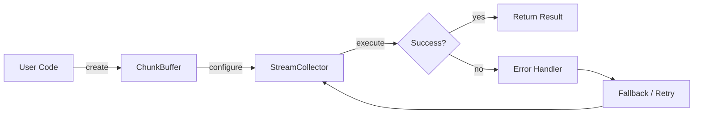
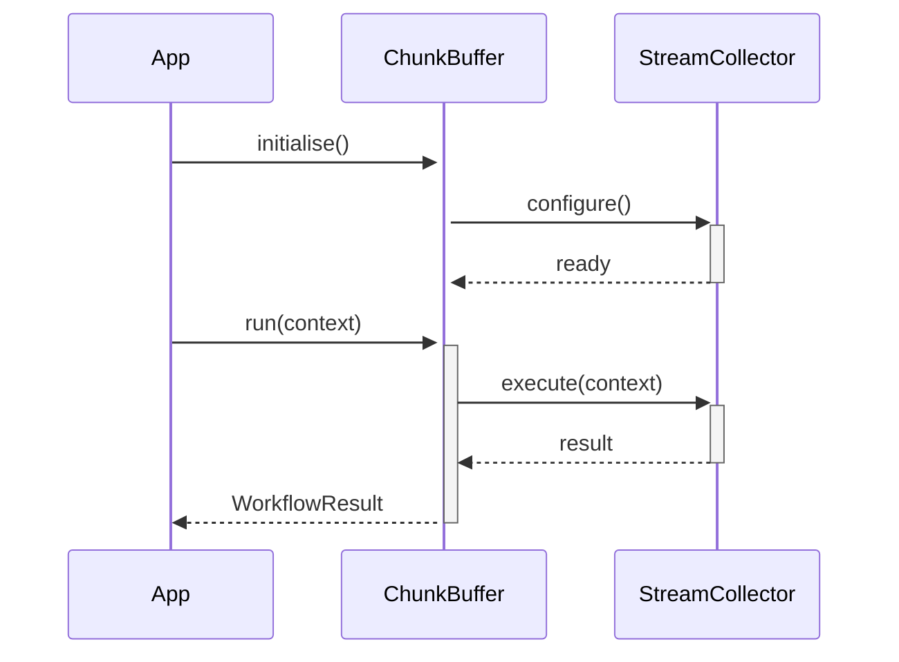

<div align="center">

</div>

# agent-stream

**Streaming response handling for LLM agents — chunk accumulation, SSE parsing, partial callbacks, stream interruption.**

[](https://pypi.org/project/agent-stream/) [](https://python.org) [](LICENSE) [](#)

---

## The Problem

Without streaming, the user waits for the entire response before seeing anything — perceived latency is total latency. Streaming reduces time-to-first-token and enables real-time pipelines that buffer-and-batch cannot match.

## Installation

```bash
pip install agent-stream
```

## Quick Start

```python
from agent_stream import ChunkBuffer, StreamCollector, StreamProcessor

# Initialise
instance = ChunkBuffer(name="my_agent")

# Use
# see API reference below
print(result)
```

## API Reference

### `ChunkBuffer`

```python
class ChunkBuffer:
    """A fixed-capacity text buffer for streaming chunks.
    def __init__(self, max_size: int = 10_000) -> None:
    def write(self, chunk: str) -> None:
        """Append *chunk* to the buffer.
    def read(self, n: int = -1) -> str:
        """Consume and return up to *n* characters (or all if n == -1)."""
```

### `StreamCollector`

```python
class StreamCollector:
    """Accumulates text chunks from a streaming source.
    def __init__(
    def feed(self, chunk: str | bytes) -> None:
        """Process one chunk, appending it to the internal buffer.
    def collect(self, stream: Iterable[str | bytes]) -> str:
        """Drain *stream*, accumulate all chunks, return full text.
    def reset(self) -> None:
        """Clear accumulated state so the collector can be reused."""
```

### `StreamProcessor`

```python
class StreamProcessor:
    """Lazy, fluent stream processing pipeline.
    def __init__(self, stream: Iterable) -> None:
    def filter(self, predicate: Callable[[object], bool]) -> "StreamProcessor":
        """Keep only chunks for which *predicate* returns truthy."""
    def map(self, transform: Callable[[object], object]) -> "StreamProcessor":
        """Apply *transform* to every chunk."""
    def take(self, n: int) -> "StreamProcessor":
        """Keep only the first *n* chunks."""
```


## How It Works

### Flow



### Sequence



## Philosophy

> *Sarasvatī* — the river goddess — flows without accumulation; a true stream processes and releases.

---

*Part of the [arsenal](https://github.com/darshjme/arsenal) — production stack for LLM agents.*

*Built by [Darshankumar Joshi](https://github.com/darshjme), Gujarat, India.*
